# 🚀 Serverless CRUD API

**A fully serverless, scalable REST API built with AWS managed services**

[](https://aws.amazon.com/)
[](https://python.org/)
[](https://aws.amazon.com/serverless/)
[](https://aws.amazon.com/dynamodb/)

---

## 📋 Table of Contents
- [Overview](#-overview)
- [Architecture](#-architecture)  
- [Tech Stack](#-tech-stack)
- [Features](#-features)
- [API Endpoints](#-api-endpoints)
- [Logging & Monitoring](#-logging--monitoring)
- [Setup & Deployment](#-setup--deployment)
- [Troubleshooting](#-troubleshooting)
- [Lessons Learned](#-lessons-learned)
- [Use Cases](#-use-cases)

---

## 🎯 Overview

This project demonstrates a production-ready serverless CRUD API architecture using AWS managed services. The system automatically scales based on demand while maintaining zero server management overhead.

**Key Benefits:**
- ⚡ **Zero Cold Start** optimization
- 🔒 **Enterprise-grade security** with IAM
- 📊 **Comprehensive logging** and monitoring
- 💰 **Cost-effective** pay-per-request model
- 🌍 **Global scalability** out of the box

---

## 🏗 Architecture

```mermaid
graph TB
    Client[📱 Client Applications<br/>Mobile/Web/API Tools]
    
    subgraph "🌐 API Layer"
        APIGW[🚪 API Gateway<br/>REST Endpoints<br/>Request Validation<br/>Rate Limiting]
    end
    
    subgraph "⚡ Compute Layer"
        Lambda1[🔧 Lambda Function<br/>CREATE Operation<br/>POST /items]
        Lambda2[🔍 Lambda Function<br/>READ Operations<br/>GET /items<br/>GET /items/:id]
        Lambda3[✏️ Lambda Function<br/>UPDATE Operation<br/>PUT /items/:id]
        Lambda4[🗑️ Lambda Function<br/>DELETE Operation<br/>DELETE /items/:id]
    end
    
    subgraph "🗄️ Data Layer"
        DDB[(🏪 DynamoDB<br/>NoSQL Database<br/>Auto-scaling<br/>Global Tables)]
    end
    
    subgraph "📊 Monitoring Layer"
        CW[📈 CloudWatch<br/>Logs & Metrics<br/>Alarms & Dashboards]
        XRay[🔍 X-Ray<br/>Distributed Tracing<br/>Performance Analysis]
    end
    
    subgraph "🔐 Security Layer"
        IAM[🛡️ IAM Roles<br/>Least Privilege Access<br/>Service-to-Service Auth]
    end
    
    Client -->|HTTPS Requests| APIGW
    APIGW --> Lambda1
    APIGW --> Lambda2
    APIGW --> Lambda3
    APIGW --> Lambda4
    
    Lambda1 --> DDB
    Lambda2 --> DDB
    Lambda3 --> DDB
    Lambda4 --> DDB
    
    Lambda1 -.->|Logs & Metrics| CW
    Lambda2 -.->|Logs & Metrics| CW
    Lambda3 -.->|Logs & Metrics| CW
    Lambda4 -.->|Logs & Metrics| CW
    
    Lambda1 -.->|Traces| XRay
    Lambda2 -.->|Traces| XRay
    Lambda3 -.->|Traces| XRay
    Lambda4 -.->|Traces| XRay
    
    IAM -.->|Permissions| Lambda1
    IAM -.->|Permissions| Lambda2
    IAM -.->|Permissions| Lambda3
    IAM -.->|Permissions| Lambda4
    
    style Client fill:#e1f5fe
    style APIGW fill:#fff3e0
    style Lambda1 fill:#f3e5f5
    style Lambda2 fill:#f3e5f5
    style Lambda3 fill:#f3e5f5
    style Lambda4 fill:#f3e5f5
    style DDB fill:#e8f5e8
    style CW fill:#fff8e1
    style XRay fill:#fff8e1
    style IAM fill:#ffebee
```



---

## 🛠 Tech Stack

| Service | Purpose | Benefits |
|---------|---------|----------|
| **🔧 AWS Lambda** | Serverless compute engine | Auto-scaling, pay-per-request, zero server management |
| **🚪 API Gateway** | RESTful API management | Built-in throttling, caching, monitoring |
| **🏪 DynamoDB** | NoSQL database | Single-digit millisecond latency, unlimited scale |
| **📈 CloudWatch** | Logging and monitoring | Real-time metrics, custom dashboards, alerting |
| **🛡️ IAM** | Identity and access management | Fine-grained permissions, security best practices |

---

## ✨ Features

### 🔧 Core Functionality
- **Create** → Add new items with validation
- **Read** → Retrieve single items or list all items with pagination
- **Update** → Modify existing items with conflict detection
- **Delete** → Remove items with soft delete option

### 📊 Advanced Features
- **Request validation** and sanitization
- **Comprehensive error handling** with proper HTTP status codes
- **Structured logging** with correlation IDs
- **Performance monitoring** and alerting
- **Rate limiting** and throttling protection

---

## 🌐 API Endpoints

| Method | Endpoint | Description | Request Body |
|--------|----------|-------------|--------------|
| `POST` | `/items` | Create new item | `{"name": "string", "description": "string"}` |
| `GET` | `/items` | List all items | Query params: `limit`, `lastKey` |
| `GET` | `/items/{id}` | Get item by ID | None |
| `PUT` | `/items/{id}` | Update item | `{"name": "string", "description": "string"}` |
| `DELETE` | `/items/{id}` | Delete item | None |

### 📝 Sample Request/Response

**Create Item:**
```bash
curl -X POST https://api.example.com/items \
  -H "Content-Type: application/json" \
  -d '{
    "name": "Sample Item",
    "description": "This is a sample item for testing"
  }'
```

**Response:**
```json
{
  "statusCode": 201,
  "data": {
    "id": "item_123456789",
    "name": "Sample Item",
    "description": "This is a sample item for testing",
    "createdAt": "2024-01-15T10:30:00Z",
    "updatedAt": "2024-01-15T10:30:00Z"
  },
  "message": "Item created successfully"
}
```

---

## 📊 Logging & Monitoring

### 🏗 Logging Architecture


### 📋 Log Structure

```json
{
  "timestamp": "2024-01-15T10:30:00.123Z",
  "requestId": "abc-123-def-456",
  "level": "INFO",
  "service": "serverless-crud-api",
  "operation": "CREATE_ITEM",
  "userId": "user_789",
  "duration": 245,
  "statusCode": 201,
  "message": "Item created successfully",
  "metadata": {
    "itemId": "item_123456789",
    "tableName": "items-table"
  }
}
```

### 📈 Key Metrics Monitored

- **Performance**: Response time, cold start duration
- **Reliability**: Error rates, success rates, availability
- **Usage**: Request volume, concurrent executions
- **Business**: Items created/updated/deleted per hour

---

## 🚀 Setup & Deployment

### Prerequisites
- AWS CLI configured with appropriate permissions
- Python 3.9+ installed locally
- Serverless Framework or AWS SAM CLI

### Quick Start

1. **Clone the repository**
   ```bash
   git clone https://github.com/yourusername/serverless-crud-api.git
   cd serverless-crud-api
   ```

2. **Install dependencies**
   ```bash
   pip install -r requirements.txt
   ```

3. **Deploy to AWS**
   ```bash
   # Using Serverless Framework
   serverless deploy
   
   # Or using AWS SAM
   sam build && sam deploy --guided
   ```

4. **Test the API**
   ```bash
   curl -X GET https://your-api-gateway-url.amazonaws.com/dev/items
   ```

---

## 🐛 Troubleshooting

### Common Issues & Solutions

| Issue | Symptoms | Solution |
|-------|----------|----------|
| **403 Forbidden** | API returns access denied | Check IAM permissions, enable Lambda proxy integration |
| **500 Internal Error** | Lambda function fails | Review CloudWatch logs, check Python syntax |
| **400 Bad Request** | Invalid request format | Validate JSON structure and required fields |
| **Cold Start Latency** | Slow first requests | Implement provisioned concurrency or connection pooling |

---

## 🎓 Lessons Learned

### 🔧 Technical Insights
- **IAM permissions** are critical for service-to-service communication
- **Lambda proxy integration** is essential for proper API Gateway responses
- **CloudWatch logs** are invaluable for debugging serverless applications
- **DynamoDB design patterns** significantly impact performance and cost

### 🏗 Architecture Best Practices
- Design for **idempotency** in all operations
- Implement **proper error handling** and retry mechanisms  
- Use **structured logging** with correlation IDs
- Monitor **business metrics**, not just technical metrics

---

## 🌍 Use Cases

This serverless architecture pattern is ideal for:

| Use Case | Benefits | Examples |
|----------|----------|----------|
| **🛒 E-commerce APIs** | Auto-scaling during sales events | Product catalogs, inventory management |
| **👥 User Management** | Secure, scalable user operations | Registration, profiles, preferences |
| **🌡️ IoT Data Collection** | Handle variable sensor data loads | Environmental monitoring, smart devices |
| **📱 Mobile Backends** | Global distribution, low latency | Chat apps, social media, gaming |
| **📊 Analytics Platforms** | Cost-effective data processing | Event tracking, user behavior analysis |

---

## 🤝 Contributing

1. Fork the repository
2. Create a feature branch (`git checkout -b feature/amazing-feature`)
3. Commit your changes (`git commit -m 'Add amazing feature'`)
4. Push to the branch (`git push origin feature/amazing-feature`)
5. Open a Pull Request

---

## 📄 License

This project is licensed under the MIT License - see the [LICENSE](LICENSE) file for details.

---
## 🙏 Acknowledgments

- AWS Documentation and best practices guides
- Serverless community for architecture patterns
- CloudWatch logging strategies from AWS Well-Architected Framework
